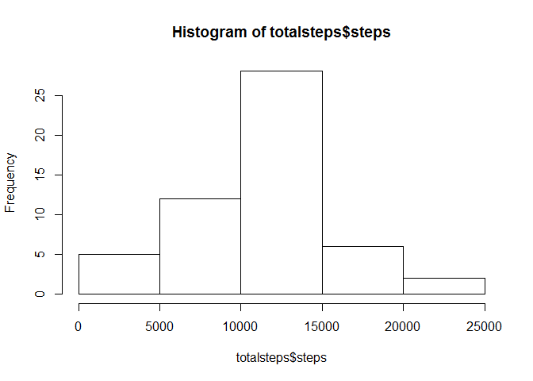

# Reproducible Research: Peer Assessment 1


## Loading and preprocessing the data
Load the activity.csv file into R

```r
data = read.csv('activity.csv', header = T)
```


## What is mean total number of steps taken per day?
Calculate the total steps per day

```r
totalsteps <- aggregate(steps ~ date, data, sum)
head(totalsteps)
```

```
##         date steps
## 1 2012-10-02   126
## 2 2012-10-03 11352
## 3 2012-10-04 12116
## 4 2012-10-05 13294
## 5 2012-10-06 15420
## 6 2012-10-07 11015
```

```r
hist(totalsteps$steps)
```

 

Calculate the mean and median steps:

```r
mean(totalsteps$steps, na.rm=TRUE)
```

```
## [1] 10766.19
```

```r
median(totalsteps$steps, na.rm=TRUE)
```

```
## [1] 10765
```

## What is the average daily activity pattern?


## Imputing missing values


## Are there differences in activity patterns between weekdays and weekends?
