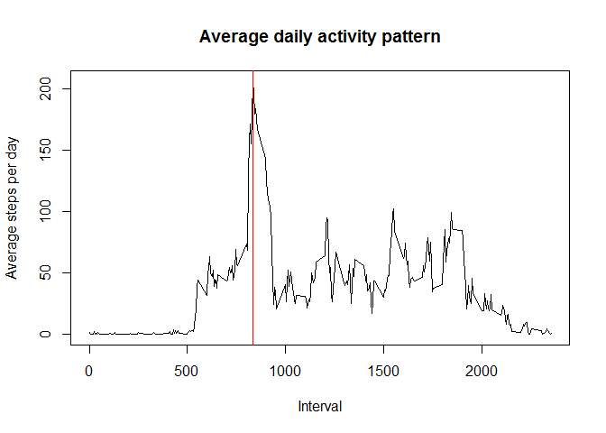
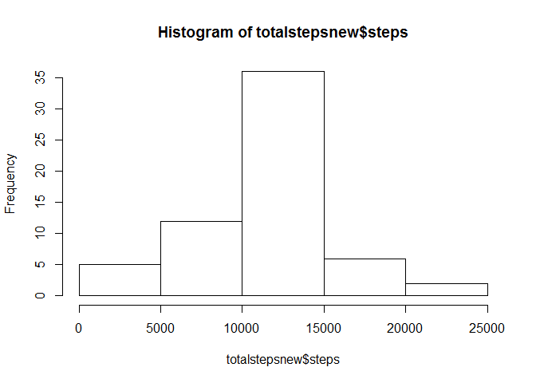
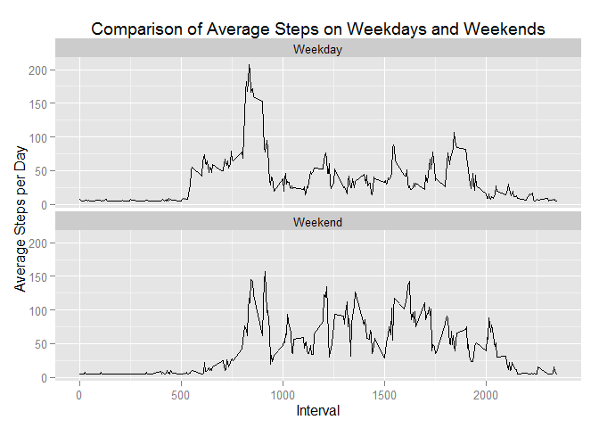

# Reproducible Research: Peer Assessment 1


## Loading and preprocessing the data
Load the activity.csv file into R

```r
data = read.csv('activity.csv', header = T) #load data
options("scipen" =100, "digits" = 2) # override R's tendency to use scientific notation
library(ggplot2) #load graphics package
```

```
## Warning: package 'ggplot2' was built under R version 3.1.3
```


## What is mean total number of steps taken per day?
Calculate the total steps per day

```r
totalsteps <- aggregate(steps ~ date, data, sum)
head(totalsteps)
```

```
##         date steps
## 1 2012-10-02   126
## 2 2012-10-03 11352
## 3 2012-10-04 12116
## 4 2012-10-05 13294
## 5 2012-10-06 15420
## 6 2012-10-07 11015
```

```r
hist(totalsteps$steps)
```

 

Calculate the mean and median steps:

```r
mean(totalsteps$steps, na.rm=TRUE)
```

```
## [1] 10766
```

```r
median(totalsteps$steps, na.rm=TRUE)
```

```
## [1] 10765
```

## What is the average daily activity pattern?

```r
timeseries <- aggregate(steps ~ interval, data = data, FUN = mean) #aggregate data
maxsteps <- timeseries[which.max(timeseries$steps),]$interval #identify interval with max steps

plot(timeseries, type="l",xlab="Interval",ylab="Average steps per day",
     main="Average daily activity pattern")
abline(v = maxsteps , col = "red")
```

 

The maximum number of steps occur during interval **835**.


## Imputing missing values
1. ***Calculate the number of missing values:***


```r
missing = sum(is.na(data$steps))
```

The total number of missing values is **2304**.


2. ***Fill in the missing values with the mean:***

```r
newdata <- data
newdata[is.na(data$steps), ]$steps <- mean(data$steps,na.rm=TRUE)
```

3. ***Create a new dataset:***

```r
newdata[1:10,]  #Print first ten lines
```

```
##    steps       date interval
## 1     37 2012-10-01        0
## 2     37 2012-10-01        5
## 3     37 2012-10-01       10
## 4     37 2012-10-01       15
## 5     37 2012-10-01       20
## 6     37 2012-10-01       25
## 7     37 2012-10-01       30
## 8     37 2012-10-01       35
## 9     37 2012-10-01       40
## 10    37 2012-10-01       45
```

4. ***Create a histogram and calculate the mean and median of the new dataset:***

```r
totalstepsnew <- aggregate(steps ~ date, newdata, sum)
hist(totalstepsnew$steps)
```

 

Calculate the mean and median steps:

```r
mean(totalstepsnew$steps)
```

```
## [1] 10766
```

```r
median(totalstepsnew$steps)
```

```
## [1] 10766
```

### Mean comparison:
The average number of  steps per day of the original dataset is ***10766.19*** and the average of the imputed
dataset is ***10766.19***. The values are similar.

### Median comparison:
The median number of  steps per day of the original dataset is ***10765*** and the median of the imputed
dataset is ***10766.19***. The values are similar.


## Are there differences in activity patterns between weekdays and weekends?


```r
newdata$date <- as.Date(newdata$date, "%Y-%m-%d")
newdata$day <- weekdays(newdata$date)
newdata$type <- c("Weekday")
for (i in 1:nrow(newdata)){
  if (newdata$day[i] == "Saturday" || newdata$day[i] == "Sunday"){
    newdata$type[i] <- "Weekend"
  }
}
newdata$type <- as.factor(newdata$type)
aggdatatype <- aggregate(steps ~ interval+type, newdata, mean)
qplot(interval, steps, data=aggdatatype, geom=c("line"), xlab="Interval", 
      ylab="Average Steps per Day", main="Comparison of Average Steps on Weekdays and Weekends") + facet_wrap(~ type, ncol=1)
```

 

